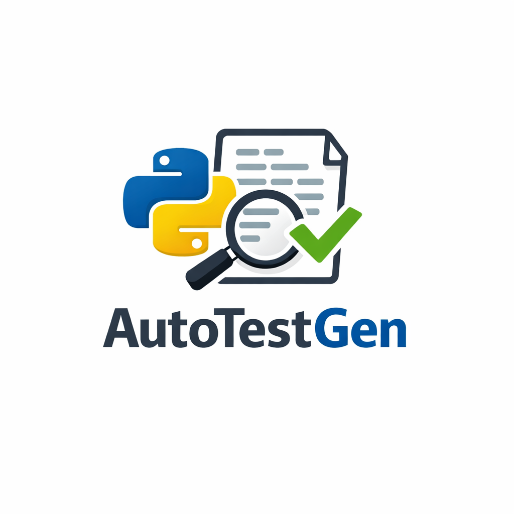

# pytest-generator: AI-Powered Unit Test Generation

Generate high-quality pytest test cases from Python function signatures and docstrings. Runs entirely on your local machine with zero API costs and complete privacy.

<p align="center">
  
</p>

*Testing boilerplate is tedious. Now you can generate it without sending your code anywhere.*

We fine-tuned a specialized 8B language model to generate pytest test cases from Python function signatures. Since it runs entirely locally, you get instant test generation with zero API costs, no cloud dependencies, and complete privacy.

**Your code never leaves your machine.**

> **Note:** pytest-generator produces test skeletons (~77% accuracy on an 8B model). Generated tests are meant to be reviewed and refined by developers before use not run as-is.

---

## Performance Results

| Model | Parameters | LLM-as-a-Judge | Exact Match | Link |
|-------|------------|----------------|-------------|------|
| Deepseek.v3.1 (teacher) | 671B | 85% | 86% | — |
| **Qwen3-8B (fine-tuned)** | **8B** | **77%** | **83%** | [HuggingFace](https://huggingface.co/Priyansu19/pytest-8b) |
| Qwen3-8B Q4 (quantized) | 8B | ~70% | — | [HuggingFace](https://huggingface.co/Priyansu19/pytest-8b-GGUF) |
| Qwen3-8B (base) | 8B | 15% | 36% | — |

The fine-tuned **Qwen3-8B** model approaches the **671B** teacher's performance while being **80× smaller**. The Q4 quantized variant preserves most accuracy and enables efficient CPU-only local inference, making it ideal for private, on-device test generation.

**Dependency Resolution Improvement:**
- Method name hallucination: 67% → 3% (-96%)
- Test pass rate: 33% → 97% (+194%)
- Method name accuracy: **100%** for both pip packages and local classes

---

## Quick Start

### 1. Clone the Repository

```bash
git clone https://github.com/Priyansurout/pytest-generator.git
cd pytest-generator
```

### 2. Install Dependencies

```bash
pip install -r requirements.txt
```

### 3. Download the Model

The model (~5GB) is auto-downloaded on first run, but you can pre-download it to avoid a silent wait:

```bash
# ~5GB, takes a few minutes
python -c "from huggingface_hub import hf_hub_download; hf_hub_download(repo_id='Priyansu19/pytest-8b-GGUF', filename='pytest-8b-q4_k_m.gguf', local_dir='.')"
```

### 4. Generate Tests

**Single file**

```bash
# Basic usage
python pytest_generator.py calculator.py

# Custom output directory
python pytest_generator.py calculator.py -o ./tests/

# Disable streaming output
python pytest_generator.py calculator.py --no-stream
```

**Batch processing (entire directory)**

```bash
# Process all Python files in src/
python pytest_generator.py ./src/ -o ./tests/
```

**Custom configuration**

```bash
# Create myconfig.yaml (see Configuration section)
python pytest_generator.py app.py myconfig.yaml
```

### 5. Run Generated Tests

A `conftest.py` is auto-generated in the output directory that adds the source module's path to `sys.path`, so tests work out of the box:

```bash
pytest generated_tests/
```

For async tests (`@pytest.mark.asyncio`), `pytest-asyncio` is included in `requirements.txt`.

---

## Dependency-Aware Mock Generation

One of the hardest parts of writing tests for real-world code is knowing **exactly what methods to mock**. Without this information, LLMs hallucinate method names that don't exist, generating tests that fail immediately.

pytest-generator solves this using a **two-stage hybrid approach**:

### Stage 1: Local Project Scan (AST)

On startup, the tool scans your project directory using Python's `ast` module and builds an index of every class and its methods. This works for any `.py` file in your project **without executing any code**.

```bash
# Scan a specific directory (default: auto-detect project root)
python pytest_generator.py app.py --scan-root ./src/

# Save the index for reuse (skip re-scanning on next run)
python pytest_generator.py app.py --save-index /tmp/index.json

# Load a previously saved index
python pytest_generator.py app.py --load-index /tmp/index.json

# Disable dependency resolution entirely (fastest, pre-v2 behavior)
python pytest_generator.py app.py --no-index
```

### Stage 2: Runtime Inspection (importlib + inspect)

For classes imported from **pip-installed packages** (e.g., `httpx`, `requests`, `pathlib`), the tool imports the module at runtime and uses `inspect.signature()` to get the real method names **and argument names**.

**Example source file:**

```python
from httpx import AsyncClient

async def fetch_user(client: AsyncClient, user_id: int) -> dict:
    """Fetch a user profile from the API."""
    resp = await client.get(f"/users/{user_id}")
    return resp.json()
```

**What the model receives** (body stripped, dependency comment appended):

```python
async def fetch_user(client: AsyncClient, user_id: int) -> dict:
    """Fetch a user profile from the API."""
    # Dependencies: client.get(url)
```

**Generated test:**

```python
import pytest
from unittest.mock import AsyncMock

@pytest.mark.asyncio
async def test_fetch_user():
    mock_client = AsyncMock()
    mock_client.get.return_value.json.return_value = {"id": 1, "name": "Alice"}
    
    result = await fetch_user(mock_client, 1)
    
    assert result == {"id": 1, "name": "Alice"}
    mock_client.get.assert_called_once_with("/users/1")
```

The model uses the **real method names and argument signatures** — no hallucination.

### Resolution Priority

| Source | Covers | Argument Names |
|--------|--------|----------------|
| Runtime inspection (`importlib` + `inspect`) | Pip packages + installed local packages | ✅ Yes — full signatures |
| AST codebase index | Local `.py` files in your project | ✅ Method names only |
| None | Unresolvable classes | ❌ No dependency block injected |

### Known Limitations

#### Architecture Limitations

- **Import side effects:** If a module runs code on import (opens a DB connection, loads config, parses CLI args), the import will fail silently and that dependency is skipped.
- **Relative imports:** `from .module import MyClass` only resolves if the package is properly installed in the current environment.
- **Missing packages:** If a pip package is not installed, runtime inspection falls back to the AST index (or skips if not found).
- **Dynamic factories:** `boto3.client('s3')` and similar dynamic factories cannot be inspected. Use type stubs as a workaround: `from mypy_boto3_s3.client import S3Client`
- **Dynamically generated methods:** Methods added via `__getattr__` or metaclasses at runtime won't appear in the dependency block.

#### Model Limitations (8B Size)

The 8B model occasionally generates tests with minor issues:

- **Wrong parameter counts:** May pass 2 parameters to a 1-parameter function
- **Instantiation instead of mocking:** May try `User()` instead of `MagicMock(spec=User)`
- **Scope issues:** May use variables outside fixture scope
- **Incomplete tests:** May cut off if token limit (3072) is reached

**Overall quality:** ~77% (method names 100% accurate, usage sometimes needs adjustment)

**Recommendation:** Always review generated tests before committing. The tool produces high-quality test skeletons that may need minor refinement.

---

## Configuration

pytest-generator can be customized using a YAML configuration file. All settings are optional — sensible defaults are provided.

### Model Settings

Controls which local GGUF model is used.

```yaml
model:
  repo: Priyansu19/pytest-8b-GGUF  # HuggingFace repository
  file: pytest-8b-q4_k_m.gguf      # Model file to load
```

**Available models:**
- `pytest-8b-q4_k_m.gguf` — Fast, ~5GB, recommended
- `pytest-8b-f16.gguf` — Higher quality, ~16GB, slower

### Generation Parameters

Controls how tests are generated.

```yaml
generation:
  n_ctx: 4096              # Context window size
  max_tokens: 3072         # Maximum tokens per test (increase to 4096-5120 for complex files)
  temperature: 0.05        # Randomness (low = deterministic)
  top_p: 1.0              # Nucleus sampling threshold
  repeat_penalty: 1.0      # Reduces repetitive output
  batch_size: 128          # Higher = faster, more RAM
```

**Recommended for complex files:** Increase `max_tokens` to 4096 or 5120 to avoid incomplete tests.

### Hardware Settings

Controls CPU usage.

```yaml
hardware:
  n_threads: -1  # -1 = auto-detect (all cores - 2)
```

Set a fixed value to limit CPU usage, or use `-1` to auto-detect and reserve cores for the system.

### Output Settings

Controls where generated tests are written.

```yaml
output:
  default_dir: ./generated_tests/  # Default directory (overridable with -o flag)
```

**Usage:**

```bash
python pytest_generator.py app.py myconfig.yaml
```

---

## Usage Examples

pytest-generator analyzes your Python files, extracts functions, and generates structured pytest test cases locally. Tests are written to `test_<filename>.py` by default.

### Single File Test Generation

```bash
python pytest_generator.py calculator.py
```

**Example output:**

```
🧪 pytest-generator (CPU-Only)
============================================================
🔧 HARDWARE CONFIGURATION
Using Threads: 6

🔍 Indexing 5 file(s) from /home/user/project
✅ Indexed 3 class(es)

📄 Processing: calculator.py
✅ Found 7 function(s)

[1/7] add()
🚀 Generating...
⏱️  2.5s | 150 tokens | 60.0 tok/s

[2/7] subtract()
🚀 Generating...
⏱️  2.3s | 145 tokens | 63.0 tok/s

...

[7/7] async_calculate_bulk()
  ↳ Deps: client.get(url)
🚀 Generating...
⏱️  3.1s | 200 tokens | 64.5 tok/s

✅ Created: ./generated_tests/test_calculator.py
   Total: 18.2s | Average: 2.6s per function

✨ All done! Total time: 20.1s
Tests saved to: ./generated_tests/
```

---

## How We Built pytest-generator

### The Problem

Writing unit tests is repetitive and time-consuming. Developers often skip tests or copy boilerplate because setting up pytest scaffolding takes effort, especially for small or fast-moving projects.

Existing AI-based solutions usually rely on cloud APIs, require sending source code externally, or use models that are too large to run locally. This creates friction around privacy, cost, and offline usage.

### Our Approach

We wanted a solution that:

- **Runs locally** — No API calls, works fully offline, keeps code private
- **Is practical on developer machines** — Runs on CPU with a single GGUF model
- **Produces usable tests** — Structured pytest skeletons that developers can easily refine
- **Scales down well** — Works with quantized models without large quality loss

### Evaluating the Base Model

We evaluated the base Qwen3-8B model out of the box on our internal test set for pytest generation.

The base model performed poorly, with low exact match scores and inconsistent structure. Common failure modes included:

- Missing edge cases and error paths
- Incomplete or non-runnable pytest syntax
- Inconsistent test naming and fixture usage
- Overly generic assertions

This confirmed that while the task is clearly learnable, it is **not** reliably handled by a general-purpose base model — making it a strong candidate for targeted fine-tuning.

### Establishing a Teacher Baseline

We evaluated a large teacher model (DeepSeek V3.1, 671B) using structured prompts and reference test patterns.

The teacher achieved strong performance across both LLM-as-a-Judge and exact match metrics. This established a clear target: **could a much smaller model match this quality while running fully locally?**

### Training Pipeline

**Seed Data**

We manually created ~25 high-quality examples covering common Python function patterns, edge cases, error handling, async functions, and realistic docstrings.

**Synthetic Expansion**

Using a large teacher model, we expanded the dataset to ~10,000 training examples via knowledge distillation, ensuring consistent pytest structure and coverage patterns.

**Fine-tuning**

We fine-tuned the Qwen3-8B model using LoRA for 4 epochs, optimizing for deterministic and structured test generation.

**Quantization**

The fine-tuned model was converted to Q4_K_M format, enabling efficient CPU-only local inference with minimal quality loss.

---

## Qualitative Example

The tool extracts only the **function signature + docstring** from your source file and sends that to the model — the implementation body is intentionally stripped. The model was fine-tuned on this format, so sending the full body would be out-of-distribution.

### What the Model Sees

```python
def add(a: Union[int, float], b: Union[int, float]) -> Union[int, float]:
    """Add two numbers.

    Args:
        a: First number
        b: Second number

    Returns:
        Sum of a and b

    Raises:
        TypeError: If inputs are not numbers
    """
```

### Generated Tests

```python
import pytest
import importlib

module = importlib.import_module("module")
add = getattr(module, "add")

@pytest.mark.parametrize("a,b,expected", [
    (1, 2, 3),
    (2.5, 3.5, 6.0),
    (0, 0, 0),
])
def test_add(a, b, expected):
    result = add(a, b)
    assert result == expected

def test_add_type_error():
    with pytest.raises(TypeError):
        add("not_number", 5)
    with pytest.raises(TypeError):
        add(1, "not_number")
    with pytest.raises(TypeError):
        add("string", "string")
```

*Note: `"module"` is a placeholder — the tool automatically replaces it with the actual module name (e.g., `"calculator"`).*

---

## Train Your Own Model

pytest-generator was built using [Distil Labs](https://distillabs.ai), a platform for training compact, task-specific models. You can train your own custom version:

### 1. Create a Model

```bash
distil model create pytest-generator
```

Save the returned `<model-id>` for subsequent commands.

### 2. Upload Training Data

```bash
distil model upload-data <model-id> --data ./finetuning/data
```

### 3. Run Teacher Evaluation

Validate that a large model can solve the task before training:

```bash
distil model run-teacher-evaluation <model-id>
```

Check status:

```bash
distil model teacher-evaluation <model-id>
```

### 4. Train the Model

Start distillation to create your compact pytest generator:

```bash
distil model run-training <model-id>
```

Monitor progress:

```bash
distil model training <model-id>
```

### 5. Download the Model

Once training completes, download the Ollama-ready package:

```bash
distil model download <model-id>
```

For more details, visit the [Distil Labs documentation](https://docs.distillabs.ai).

---

## FAQ

### Q: Why not just use GPT-4 or Claude for this?

Because your code shouldn't leave your machine.

pytest-generator runs locally, works offline, and keeps everything private. No API keys, no rate limits, no usage costs, no data leakage.

---

### Q: Why not use the base Qwen3-8B model directly?

The base model is general-purpose and not optimized for pytest generation.

Out of the box, it produces:
- Incomplete or incorrect mocks
- Weak or missing assertions
- Inconsistent async handling
- Poor coverage of documented exceptions

Fine-tuning is required to reliably generate **structured, runnable pytest code**.

---

### Q: The mocks use wrong method names. What's happening?

This usually means dependency resolution couldn't find the class.

Check that:
1. The parameter has a type annotation (e.g., `db: DatabaseClient`, not just `db`)
2. The class is imported at the top of the file
3. If it's a pip package, it's installed in your current Python environment (`pip show <package>`)
4. If it's a local class, it's in a `.py` file that `--scan-root` covers

Use `--save-index /tmp/index.json` and inspect the JSON to see which classes were found.

For dynamic factories like `boto3.client('s3')`, use type stubs:
```python
from mypy_boto3_s3.client import S3Client

def upload_file(s3_client: S3Client, ...):
    # Now RuntimeInspector can find the methods
```

---

### Q: What is `config.yaml` used for?

`config.yaml` allows you to customize pytest-generator's behavior without changing code.

It controls:
- Which model is used
- Generation parameters (tokens, temperature, etc.)
- Hardware usage (CPU threads)
- Output location

If `config.yaml` is missing, pytest-generator runs with sensible defaults.

---

### Q: Is my code sent anywhere?

No.

The model is downloaded once from HuggingFace and cached locally. All parsing, inference, and test generation happen on your machine.

**Your source code never leaves your computer.**

---

### Q: Why does the first run take longer?

Two one-time costs:

- **Model download:** ~5GB GGUF file
- **Model loading:** Loading weights into RAM

After that, runs are fast since the model is cached locally.

---

### Q: Can I use pytest-generator offline?

Yes — that's the point.

- **100% offline** after initial download
- **Privacy-first** — No data ever leaves your device
- **Fast** — Local inference on CPU
- **Free** — No API costs or rate limits

---

### Q: The generated tests aren't perfect. Is that expected?

Yes. pytest-generator produces **test skeletons**, not final production tests.

The goal is to:
- Cover happy paths and edge cases
- Reflect docstring intent
- Generate runnable pytest code

You're expected to review and refine the output — but starting from a strong baseline instead of a blank file.

**Known model limitations (8B size):**
- May generate wrong parameter counts (~23% of tests)
- Method names are always correct (100% accuracy)
- Overall test quality: ~77%

If you see consistent issues, please open an issue with an example.

---

### Q: Can I train a model for my specific use case?

Yes! Visit [distillabs.ai](https://www.distillabs.ai/) to discuss custom solutions or use the platform to train your own models.

---

## Links

[](https://www.distillabs.ai/)
[](https://docs.distillabs.ai/)
[](https://github.com/distil-labs)
[](https://huggingface.co/distil-labs)
[](https://www.linkedin.com/company/distil-labs/)
[](https://join.slack.com/t/distil-labs-community/shared_invite/zt-36zqj87le-i3quWUn2bjErRq22xoE58g)

---

*Built with [Distil Labs](https://distillabs.ai) — Turn a prompt and a few examples into production-ready small language models.*